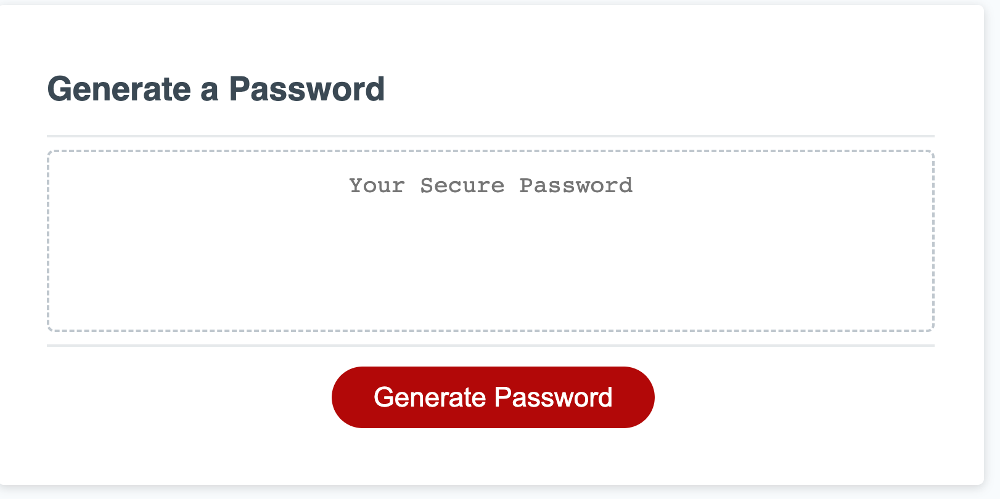

Password Generator Project 

## Description

The motivation behind this project was to help users generate a random password based on certain criteria (whether the password will have upper case, lower case letters, special characters, and numbers) that they wish to include based on a series of questions and prompts. We built this project to make it easier for users to generate a password based on their own personal preferences as to how they would like that password to look. It solves the problem of being able to take a user step by step with prompts so they can get a password based on what characters they'd like to include. It also tests for user error. I learned a lot about if statements, for loops and certain methods that are used in javascript. 

## Usage

This website can be used by clicking on the password generator button. The user is then prompted to indicate how many characters their password would like to be. Then, they have to answer a series of questions asking if they want to include specific characters by clicking "OK" or "cancel." A password is then generated. If they don't select any characters to include, then a password is not generated. 

Instructions for ![PasswordGenerator]: If you click on the "password generator" button, you will be asked a series of questions to answer based on how you want your password to look. 

Link to live site: https://rosiedeng1.github.io/ClassAssignmentJavascript/

## Credits

How to use Concate method: https://developer.mozilla.org/en-US/docs/Web/JavaScript/Reference/Global_Objects/Array/concat
Math.Random method: https://www.w3schools.com/js/js_random.asp
For loops: https://www.w3schools.com/js/js_loop_for.asp

## License

Please refer to the LICENSE in the repo.

